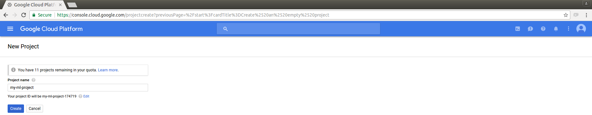
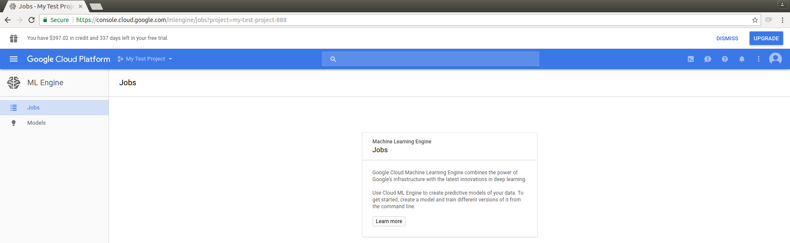

# The newb guide to Google Cloud Machine Learning (ML) Engine - Prequel

July 20th 2017

## Foreword

Google Cloud Machine Learning (ML) Engine (https://cloud.google.com/ml-engine/) is a managed service that enables you to easily build machine learning models, that work on any type of data, of any size. The service is integrated with Google Cloud Dataflow for feature processing, Google Cloud Storage for data storage, Google Datalab to build model among others useful services.  As a managed service, it automates all resource provisioning, monitoring and scaling, allowing developers to solely focus on model and prediction development.

This blog will focus on online prediction services using Google Cloud Machine Learning (ML) Engine using a model saved on Google Storage.

This blog will not focus on training or local predictions using Google Cloud Machine Learning (ML) Engine.

NOTE: Online prediction services is a Beta feature of Cloud ML Engine. It might be changed in backward-incompatible ways and is not subject to any SLA or deprecation policy.

## Start here
If you are new to Google Cloud Platform and its products, you might find the documentation a bit lacking or tough to interpret without concrete examples.  Maybe you are a Google search wizard and can easily find whatever resources you need to learn from.  As for myself, finding an easy step-by-step resource is like looking for a needle in a haystack.

This blog is my journey on how to perform online predictions using Google Could Machine Learning (ML) Engine.  You are expected to have some Python and TensorFlow background to be able to flow this guide.

NOTE: I use Python 3.5.2 with TensorFlow 1.2.1 in a Linux environment.

## Installing and setting up stuff

### 1) Virtual environment

A virtual environment is a tool to keep the dependencies required by different projects in separate places, by creating virtual Python environments for them.  To learn more about virtual environment, you may checkout this url:  http://python-guide-pt-br.readthedocs.io/en/latest/dev/virtualenvs/

    $ pip install virtualenv

#### Creating virtualenv

I will make a project folder called ml-engine and in that folder, I will create a virtual environment call ml-venv using the following commands:

    $ virtualenv -p /usr/bin/python3.5 ml-venv

#### Starting, verifying and stopping the virtualenv

To start using the virtual environment, it needs to be activated:

    $ source ml-venv/bin/activate

To verify that the correct python and version has been installed:

    (ml-venv) $   which python
    /home/{user}/ml-engine/ml-venv/bin/python
    (ml-venv) $   python --version
    Python 3.5.2

NOTE: {user} would reflect the user name you have inputted during the linux setup

To stop using the virtual environment, it needs to be deactivated:

    (ml-venv) $ deactivate

### 2) TensorFlow

TensorFlow ( https://www.tensorflow.org/) is an open source software library for numerical computation using data flow graphs, developed by Google for machine learning. Nodes in the graph represent mathematical operations, while the graph edges represent the multidimensional data arrays (tensors) communicated between them. TensorFlow’s architecture allows the flexible computational deployment to one or more CPUs or GPUs in a desktop, server, or mobile device with a single API. 

In the virtualenv, simply type the following:

    (ml-venv)  $ pip install tensorflow==1.2.1

To verify that the correct TensorFlow and version has been installed:

    (ml-venv) $ pip show tensorflow
    Name: tensorflow
    Version: 1.2.1
    Summary: TensorFlow helps the tensors flow
    Home-page: http://tensorflow.org/
    Author: Google Inc.
    Author-email: opensource@google.com
    License: Apache 2.0
    Location: /home/michael/ml-engine/ml-venv/lib/python3.5/site-packages
    Requires: protobuf, numpy, markdown, werkzeug, six, backports.weakref, html5lib, bleach, wheel

### 3) Python client library

google-api-python-client is the core Python library for accessing Google APIs.

In the virtualenv, simply type the following:

    (ml-venv)  $ pip install --upgrade google-api-python-client

#### Verifying Python client library

To verify that Python client library has been installed:

    (ml-venv) $ pip show google-api-python-client
    Name: google-api-python-client
    Version: 1.6.2
    Summary: Google API Client Library for Python
    Home-page: http://github.com/google/google-api-python-client/
    Author: Google Inc.
    Author-email: UNKNOWN
    License: Apache 2.0
    Location: /home/michael/ml-engine/ml-venv/lib/python3.5/site-packages
    Requires: oauth2client, six, httplib2, uritemplate

### 4) Google Cloud Platform

NOTE:  A Gmail account is required to be associated with a Google Cloud Platform account

a) Navigate to the cloud console project page (https://console.cloud.google.com/cloud-resource-manager) and create a new project. I will name my project: my-ml-project

Creating a project:
 

Project created:
 

To learn more about Creating and Managing Projects, you may checkout this url:
https://cloud.google.com/resource-manager/docs/creating-managing-projects

b) Enable billing for your new project.  Don't worry, Google is kind and has given you $300USD credit to use towards your project.  Even if you have used up all the credit, you will never be billed a cent, unless you approve to do so.  Google has decent documentation on how to enable billing for a project: https://support.google.com/cloud/answer/6293499?hl=en

c) To enable Goggle Cloud Machine Learning (ML) Engine, select ML Engine in products and services. After waiting for the background magic to complete and watching a nice little graphic, you will see the following page:

d) Cloud Storage lets you store unstructured objects in containers called buckets. To create a bucket, select Storage Engine in products and services.

I will create a bucket call "my-ml-project-888" and use the regional location closest to me, "us-east1".

I will create and leave empty for now, three sub folders call "input" (input data folder), "output" (output result folder) and "regression" (model location folder).

### 5) Google Cloud SDK

Command-line interface for Google Cloud Platform products and services (https://cloud.google.com/sdk/downloads#apt-get).  

Create an environment variable for the correct distribution: 

    (ml-venv)  $ export CLOUD_SDK_REPO="cloud-sdk-$(lsb_release -c -s)"

Add the Cloud SDK distribution URI as a package source: 

    (ml-venv)  $ echo "deb http://packages.cloud.google.com/apt $CLOUD_SDK_REPO main" | sudo tee -a /etc/apt/sources.list.d/google-cloud-sdk.lis

Import the Google Cloud public key: 

    (ml-venv)  $c url https://packages.cloud.google.com/apt/doc/apt-key.gpg | sudo apt-key add -

Update and install the Cloud SDK: 

    (ml-venv)  $ sudo apt-get update && sudo apt-get install google-cloud-sdk

Run gcloud init to config gcloud:

gcloud init launches an interactive "getting started workflow" for gcloud. It authorizes gcloud to access Google Cloud Platform using your user account credentials and sets various properties like project or regional location in a gcloud configuration.

    (ml-venv)  $ gcloud init

Well, I think this is a good place to stop.  Next episode, we will look at some example TensorFlow code.
