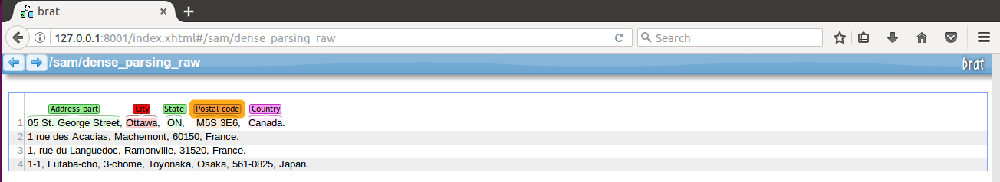
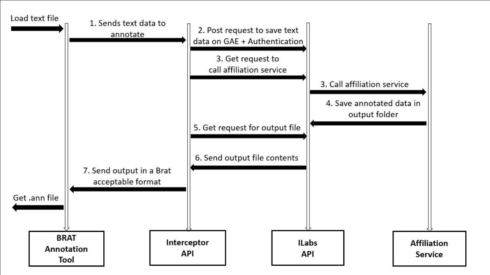
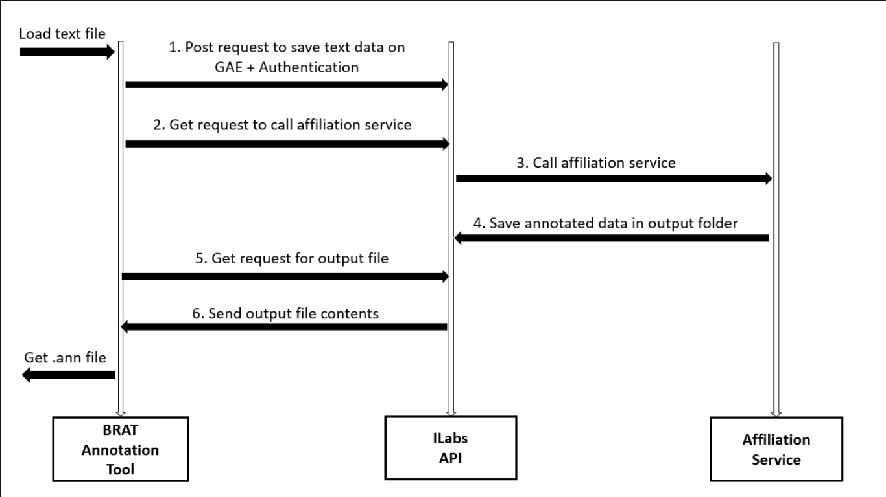

Named Entity Recognition(NER) is one of the key tasks in information extraction. iLabs provides services for NER and Brat is used for creating annotations for NER, adding on it has a wholesome interface. So, should we provide basic annotation tool to our users?

###About iLabs API
iLabs provides services that annotates text data. This text data includes legal documents, references, and affiliations. Now, let's take a scenario, where we want to annotate the affiliations of authors writing journals and research papers. iLabs API works in three simple steps:

#####1- Post request to save the data to be annotated
    
    http://api.innodatalabs.com/v1/documents/input/{filename}

#####2- Get request to call the affiliation tagging service on the saved data

    http://api.innodatalabs.com/v1/reference/ilabs.affiliation/{filename}

#####3- Get request to bring the annotated data 

    http://api.innodatalabs.com/v1/documents/output/{filename}

Same can be done for legal documents and reference tagging. Any application that needs automatic tagging can make these three requests.

###About Brat
Brat is an open source web based tool used to create annotations. It allows you to add desired labels to the selected text spans. Brat also provides a wholesome interface to achieve best user experience through its visualizations.

There are many advantages to use Brat, reasons mentioned here are important from iLabs perspective:
* High-quality visualizations with wholesome user interface
* Integrates well with other annotation services
* Easy to configure
* Easily embeddable inside any web page

In spite of all these good things, there is a limitation as well. It has limited use of shortcuts, one cannot control Brat by using keyboard only.  
As mentioned above configuring brat is easy. This can be handled by making minor changes in four configuration files.
* tools.conf: annotation tool configuration
* annotation.conf: annotation type configuration
* visual.conf: annotation display configuration 
* kb_shortcuts.conf: keyboard shortcut tool configuration

#####How to use Brat? 
Brat can be used to annotate the text and use the extracted information to train a machine learning model. It can also be used to display the automatically annotated text generated by some web service (in this case iLabs API) 

##Integrating Brat with iLabs services

In order to enable Brat so that it calls iLabs services, we need to do some configurations in Brat and connect iLabs API. There are two ways to do this.

#####1- Make an interceptor service which calls iLabs API and Brat calls this interceptor service.

The interceptor is a restful API which acts as a medium of communication between Brat and iLabs services. This service also handles data format conversions. The advantage of using this service is that, it is completely separate from Brat, we change nothing in brat, though, it is overhead itself. But, if you want you can handle all the things in your API itself and communicate directly with Brat.   

#####2- Directly call the iLabs API from brat

Here you can see Brat is directly calling iLabs services. All the data format conversions are done inside Brat, so we have changed it for our better use.
All these things can be directly done in the API. iLabs is not doing so because our services are used in many other applications, so all this is done to keep it general.
 

####Some Important Links
* To use iLabs services go to following link and sign up:

    https://developer.innodatalabs.com
    
* You can download Brat from:

    http://brat.nlplab.org/index.html
    
* Installation instruction for Brat can be found at: 

    http://brat.nlplab.org/installation.html
