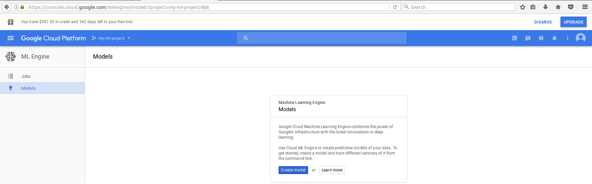
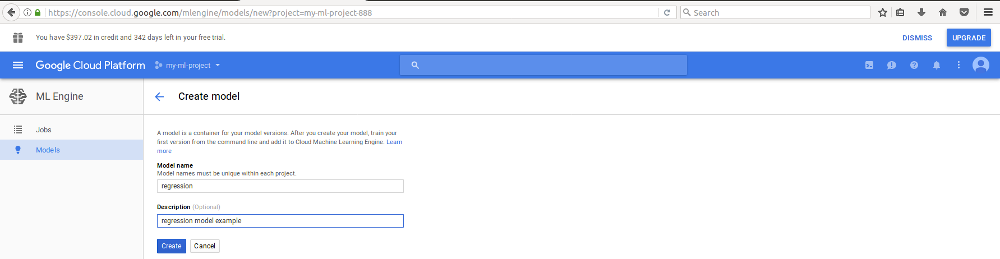
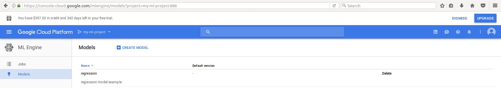
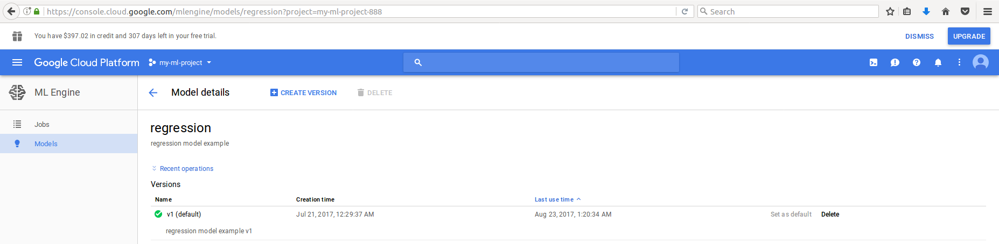
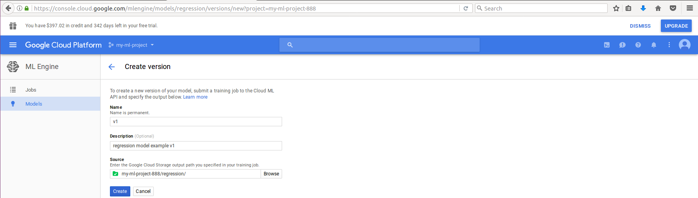
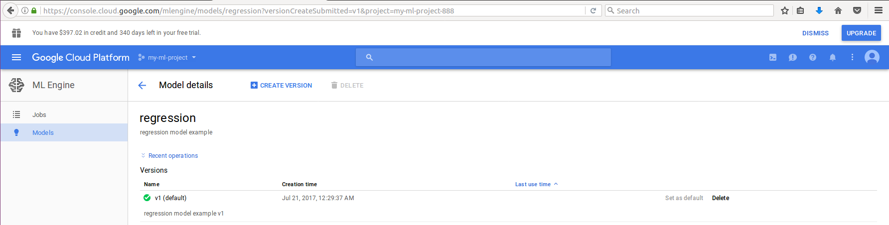

# The newb guide to Google Cloud Machine Learning (ML) Engine - Episode One

August 15th 2017

As promised, we will look at some example TensorFlow code.  The following will be the base TensorFlow code our Google Cloud Machine Learning (ML) Engine model we will be built upon:

## Base TensorFlow code

```python

import json
import tensorflow as tf

from tensorflow.python.lib.io import file_io


# Google Storage locations
GS_BUCKET               = "gs://my-ml-project-888/"
INPUT_FOLDER            = "input/"
OUTPUT_FOLDER           = "output/"
INPUT_FILENAME          = "feed_dict.json"
OUTPUT_FILENAME         = "result.json"


def read_bucket_json(filename):
    # reads a json file from Google Storage
    with file_io.FileIO(GS_BUCKET+INPUT_FOLDER+filename, "r") as json_file:
        json_data = json.load(json_file)

    return json_data


def write_bucket_json(json_data, filename):
    # writes a json file to Google Storage
    with file_io.FileIO(GS_BUCKET+OUTPUT_FOLDER+filename, "w") as json_file:
        json.dump(json_data, json_file)


def model():
    # start session
    session = tf.Session()

    # start model build

    # model variables 
    m = tf.Variable(0.5, name="m")
    b = tf.Variable(1.0, name="b")

    # feed_dict placeholder 
    x = tf.placeholder(tf.float32, name="x")
    # read the input file from Google Storage
    feed_dict = read_bucket_json(INPUT_FILENAME)

    # operation 
    y = tf.add(tf.multiply(m, x), b, name="y")
    # end model build

    # initialize all the variables
    session.run(tf.global_variables_initializer())

    # run the operation
    return session.run(y, feed_dict=feed_dict)


def main(_):
    print("Running model...")

    # result is np.array [ 1.5  2.   2.5]
    result = model()
    print(result)

    # write the result to Google Storage
    write_bucket_json({"y": result.tolist()}, OUTPUT_FILENAME)


if __name__ == "__main__":
    tf.app.run()

```

In the above code, we have defined a simple model which will produce a result using the varibles we have defined.  The feed_dict values are loaded from a file located on Google Storage and the model variables are define in the code.
The output of the above code will print the result [ 1.5  2.   2.5] to the screen and the dictionary {"y": [1.5, 2.0, 2.5]} will be written to an output file located on Google Storgage.  (Some tensorflow warning messages may appear, let us just ignore them for now.)

## Predictions?!?

Now, the million dollar question, how do I deploy the model and make online predictions for new data samples? 

## Answer Part 1:  SavedModel

SavedModel is the universal serialization format for TensorFlow models and what Google Cloud Machine Learning (ML) Engine requires to make predictions.  

A SavedModel contains a set of Graphs called “MetaGraphs”, compatible checkpoint to these MetaGraphs and any asset files that are needed to run the model (i.e. vocabulary files). For each MetaGraph it contains, it also stores a set of signatures which defines the set of input and output tensors.

Therefore, all you need is a SavedModel and data, you can write tools that interpret or execute the graphs inside!

To learn more about SavedModel, you may checkout this url:  https://github.com/tensorflow/tensorflow/blob/master/tensorflow/python/saved_model/README.md

In this blog, we will be using the SavedModelBuilder class to save the MetaGraphs and associated variables.  Once the model is saved to the export folder, it will be uploaded to the "regression" folder on Google Storage.


```python

import tensorflow as tf


def build_regression_signature(input_tensor, output_tensor):
    """Helper function for building a regression SignatureDef"""
    input_tensor_info = tf.saved_model.utils.build_tensor_info(input_tensor)
    signature_inputs = {tf.saved_model.signature_constants.REGRESS_INPUTS: input_tensor_info}
    
    output_tensor_info = tf.saved_model.utils.build_tensor_info(output_tensor)
    signature_outputs = {tf.saved_model.signature_constants.REGRESS_OUTPUTS: output_tensor_info}
    
    return tf.saved_model.signature_def_utils.build_signature_def(signature_inputs, signature_outputs,tf.saved_model.signature_constants.REGRESS_METHOD_NAME)


def model():
    # start session
    session = tf.Session()

    # define the folder to export the SavedModel
    export_dir = "export"

    # define the SavedModelBuilder instance with export folder
    builder = tf.saved_model.builder.SavedModelBuilder(export_dir)

    # feed_dict placeholder 
    serialized_tf_example = tf.placeholder(tf.string, name="tf_example")

    # sarse and look for a features named "x" with floating point value
    feature_configs = {"x": tf.FixedLenFeature(shape=[1], dtype=tf.float32, default_value=[0.0])}
    tf_example = tf.parse_example(serialized_tf_example, feature_configs)
   
    # start model build

    # model variables 
    m = tf.Variable(0.5, name="m")
    b = tf.Variable(1.0, name="b")

    # use tf.identity() to assign name
    x = tf.identity(tf_example["x"], name="x")  

    # operation 
    y = tf.add(tf.multiply(m, x), b, name="y")
    # end model build

    # Build the signature_def_map
    predict_input_tensor = tf.saved_model.utils.build_tensor_info(x)
    predict_signature_inputs = {"x": predict_input_tensor}

    predict_output_tensor = tf.saved_model.utils.build_tensor_info(y)
    predict_signature_outputs = {"y": predict_output_tensor}

    predict_signature_def = (
        tf.saved_model.signature_def_utils.build_signature_def(
            predict_signature_inputs, predict_signature_outputs,
            tf.saved_model.signature_constants.PREDICT_METHOD_NAME)) 

    signature_def_map = {
        "regression_x_to_y": build_regression_signature(serialized_tf_example, y),
        tf.saved_model.signature_constants.DEFAULT_SERVING_SIGNATURE_DEF_KEY: predict_signature_def}


     # initialize all the variables and then save the SavedModel
    session.run(tf.global_variables_initializer())

    builder.add_meta_graph_and_variables(
        session, 
        tags=[tf.saved_model.tag_constants.SERVING],
        signature_def_map=signature_def_map)

    builder.save()


def main(_):
    print("Saving model...")
    model()


if __name__ == "__main__":
    tf.app.run()

```

SavedModelBuilder takes the argument export_path: path of the export directory.  SavedModelBuilder will create the directory if it does not exist. 

Meta graph and variables are added to the builder using SavedModelBuilder.add_meta_graph_and_variables() with the following arguments:

    - sess is the TensorFlow session that holds the trained model you are exporting.
    - tags is the set of tags with which to save the meta graph. In this case, since we intend to use the graph in serving, we use the serve tag from predefined SavedModel tag constants. 
    - signature_def_map specifies the map of user-supplied key for a signature to a tensorflow::SignatureDef to add to the meta graph. Signature specifies what type of model is being exported, and the input/output tensors to bind to when running inference.

The special signature key serving_default specifies the default serving signature. The default serving signature def key, along with other constants related to signatures, are defined as part of SavedModel signature constants. 

## Answer Part 2:  Model Deployment

Google Cloud Machine Learning (ML) Engine can host a model and its many versions so that it is available for prediction requests. The process of hosting a saved model is called deployment. The prediction service manages the infrastructure needed to run any model at scale.

Important: Your saved model must be 250MB or smaller to deployed with Google Cloud Machine Learning (ML) Engine.

In this blog, we will use Google Cloud Platform's web interface to create our model.  Before we start, ensure the model exists in the "regression" folder on Google Storage.

### Creating a model

Under the products and services tab, select ML Engine then Models and click on the "Create model" button.
 

### Naming a model

I will name my model "regression", describe it as "regression model example" and click on the "Create" button.


### Model created

In a few simple steps, you have create a placeholder for the model.


### Creating a version

Now, we must associate a version to the above model.  Firstly, select the model you have just created.  It will bring you to the following screen and click on CREATE VERSION at the top.
 

Every model with at least one version has a default version; the default is set when the first version is created. If you request predictions specifying just a model name, Goggle Cloud Machine Learning (ML) Engine uses the default version for that model.

I will name my version "regression", describe it as "regression model example v1".  The source is its location on Google Storage: "my-ml-project-888/regression/"

NOTE: You will need the "/" at the end of the Google Storage location or you will have a bad time.
 

### Version created

After waiting what seems like enternity, the following screen will show an associated a version to your model.  Since it is the first version we have associated to the model, it will be the default version.


### Naming models and versions

    Model and version names must:
    - contain only (case-sensitive) mixed-case letters, numbers, and underscores
    - begin with a letter
    - contain 128 or fewer characters
    - be unique within a given project (for models) or model (for versions)


## Answer Part 3:  Cloud Machine Learning Engine REST APIs - to be continued...