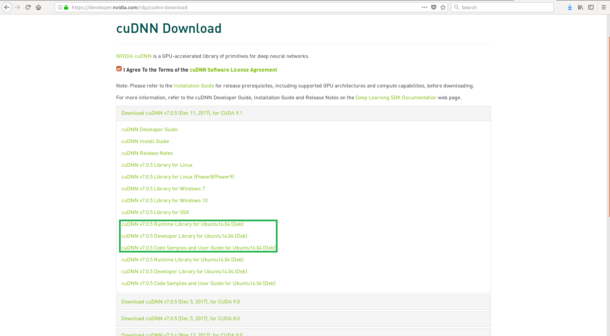

In this blog, I will be describing the step by step instructions to install TensorFlow-GPU version 1.5.0-rc1 into a Python 3.5 Virtualenv environment on Ubuntu 16.04 (64bit).

# Step 1: Pre-installation

a) Verify the system has a CUDA-capable GPU

    $ lspci | grep -i nvidia

If you do not see any settings, update the PCI hardware database that Linux maintains by entering update-pciids (generally found in /sbin) at the command line and rerun the previous lspci command.

If your graphics card is from NVIDIA and it is listed in http://developer.nvidia.com/cuda-gpus, your GPU is CUDA-capable.

    NOTE: Write down the Compute Capability value for later use in section: Installing TensorFlow from sources - Configure the installation

b) Verify your NVIDIA graphics driver is 384.81 or newer

    $ nvidia-smi

You should see the driver version in the top of the output similar to the following:


    +-------------------------------------------------------------------------+
    | NVIDIA-SMI 390.12                 Driver Version: 390.12                |
    |-------------------------------+----------------------+------------------+
    | GPU  Name        Persistence-M| Bus-Id   Disp.A | Volatile Uncorr. ECC | 
    | Fan  Temp  Perf  Pwr:Usage/Cap|    Memory-Usage | GPU-Util  Compute M. |
    |===============================+=================+======================|
    |   0  GeForce GTX 108...  Off  | 000:01:00.0  On |                  N/A |
    |  0%   30C    P8    17W / 275W |    522MiB / 11175MiB |      0% Default |
    +-------------------------------+----------------------+-----------------+

To install up-to-date NVIDIA graphics drivers, go to [NVIDIA download drivers](http://www.nvidia.com/Download/index.aspx?lang=en-us) and follow the instructions

c) Verify your version of Linux is supported

    $ uname -m && cat /etc/*release

You should see output similar to the following:

    x86_64
    DISTRIB_ID=Ubuntu
    DISTRIB_RELEASE=16.04
    DISTRIB_CODENAME=xenial
    DISTRIB_DESCRIPTION="Ubuntu 16.04.3 LTS"
    NAME="Ubuntu"
    VERSION="16.04.3 LTS (Xenial Xerus)"
    ID=ubuntu
    ID_LIKE=debian
    PRETTY_NAME="Ubuntu 16.04.3 LTS"
    VERSION_ID="16.04"
    HOME_URL="http://www.ubuntu.com/"
    SUPPORT_URL="http://help.ubuntu.com/"
    BUG_REPORT_URL="http://bugs.launchpad.net/ubuntu/"
    VERSION_CODENAME=xenial
    UBUNTU_CODENAME=xenial

The first and most important line containing x86_64, indicates you are running on a 64-bit system which is supported by CUDA. The CUDA Development Tools are only supported on some specific distributions of Linux. These are listed in the CUDA Toolkit release notes.

d) Update all the Ubuntu things!

    $ sudo apt-get update && sudo apt-get upgrade && sudo apt-get dist-upgrade

e) Verify your kernel version is supported and the correct development packages are installed

    $ uname -r

You should see output similar to the following:

    4.4.0-104-generic

    NOTE: NVIDIA recommend a kernel version of 4.4, otherwise the NVIDIA driver may not start.  

The kernel headers and development packages for the currently running kernel can be installed with:

    $ sudo apt-get install linux-headers-$(uname -r)

f) Install dependencies (you need this things to build from source)

    $ sudo apt-get install build-essential cmake python3-dev python3-numpy python3-pip python3-wheel unzip

libcupti (NVIDIA CUDA Profiler Tools Interface development files)

    $ sudo apt-get install libcupti-dev
    $ echo 'export LD_LIBRARY_PATH=/usr/local/cuda/extras/CUPTI/lib64:$LD_LIBRARY_PATH' >> ~/.bashrc

Java JDK (Bazel requires Java JDK 8 or later)

    $ sudo apt-get install openjdk-8-jdk
    $ echo "deb [arch=amd64] http://storage.googleapis.com/bazel-apt stable jdk1.8" | sudo tee /etc/apt/sources.list.d/bazel.list

Bazel (Bazel is an open-source build and test tool)

    $ curl https://bazel.build/bazel-release.pub.gpg | sudo apt-key add -
    $ sudo apt-get update && sudo apt-get install bazel
    $ sudo apt-get upgrade bazel

## Step Two: CUDA

### Download CUDA 

    $ wget http://developer.download.nvidia.com/compute/cuda/repos/ubuntu1604/x86_64/cuda-repo-ubuntu1604_9.1.85-1_amd64.deb

### Install CUDA

a) Install repository meta-data

    $ sudo dpkg -i cuda-repo-ubuntu1604_9.1.85-1_amd64.deb

b) Installing the CUDA public GPG key using network repo:

    $ sudo apt-key adv --fetch-keys http://developer.download.nvidia.com/compute/cuda/repos/ubuntu1604/x86_64/7fa2af80.pub

c) Update the Apt repository cache

    $ sudo apt-get update

d) Install CUDA

    $ sudo apt-get install cuda

### CUDA environment set-up

a) The PATH variable needs to include /usr/local/cuda-9.1/bin and the LD_LIBRARY_PATH variable needs to contain /usr/local/cuda-9.1/lib64

Edit ~/.bashrc and save the following to the end of the file:

    export PATH=/usr/local/cuda-9.1/bin${PATH:+:${PATH}}
    export LD_LIBRARY_PATH=/usr/local/cuda-9.1/lib64${LD_LIBRARY_PATH:+:${LD_LIBRARY_PATH}}

b) Restart system

## Step Three: cuDNN 

### Download cuDNN
In order to download the required cuDNN files, ensure you are registered for the [NVIDIA Developer Program](https://developer.nvidia.com/developer-program).

Go to: [NVIDIA cuDNN home page](https://developer.nvidia.com/cudnn), login and download the following files:

 

### Install cuDNN

a) Navigate to the directory containing cuDNN Debian files
    
b) Install the runtime library

    $ sudo dpkg -i libcudnn7_7.0.3.11-1+cuda9.0_amd64.deb

c) Install the developer library

    $ sudo dpkg -i libcudnn7-dev_7.0.3.11-1+cuda9.0_amd64.deb

d) Install the code samples and the cuDNN Library User Guide

    $ sudo dpkg -i libcudnn7-doc_7.0.3.11-1+cuda9.0_amd64.deb

### Verify the installation

To verify that cuDNN is installed and is running properly, compile the mnistCUDNN sample located in the /usr/src/cudnn_samples_v7 directory in the debian file.

a) Copy the cuDNN sample to a writable path and go to that folder

    $ cp -r /usr/src/cudnn_samples_v7/ $HOME
    $ cd $HOME/cudnn_samples_v7/mnistCUDNN

b) Compile the mnistCUDNN sample

    $ make clean && make

c) Run the mnistCUDNN sample

    $ ./mnistCUDNN

If cuDNN is properly installed and running, you will see a message similar to the following:

    Test passed!

    NOTE: cuDNN v7 can coexist with previous versions of cuDNN, such as v5 or v6

# Installing TensorFlow from sources

## Download and unzip TensorFlow

a) Create and navigate to a directory to containing TensorFlow files

b) Download TensorFlow

    $ wget https://github.com/tensorflow/tensorflow/archive/v1.5.0-rc1.zip

c) Unzip TensorFlow

    $ unzip v1.5.0-rc1.zip

d) Navigate into the unzipped TensorFlow folder

    $ cd tensorflow-1.5.0-rc1 

## Configure the installation

The root of the source tree contains a bash script named configure. This script asks you to identify the pathname of all relevant TensorFlow dependencies and specify other build configuration options such as compiler flags. You must run this script prior to creating the pip package and installing TensorFlow.

The following is an example execution of the configure script:

```
    $ ./configure

    You have bazel 0.9.0 installed.
    Please specify the location of python. [Default is /home/michael/python3.5-venv/bin/python]: /home/michael/python3.5-venv/bin/python
    Traceback (most recent call last):
      File "<string>", line 1, in <module>
    AttributeError: module 'site' has no attribute 'getsitepackages'
    Found possible Python library paths:
      /home/michael/python3.5-venv/lib/python3.5/site-packages
    Please input the desired Python library path to use.  Default is [/home/michael/python3.5-venv/lib/python3.5/site-packages]
    /home/michael/python3.5-venv/lib/python3.5/site-packages

    Do you wish to build TensorFlow with jemalloc as malloc support? [Y/n]: Y
    jemalloc as malloc support will be enabled for TensorFlow.

    Do you wish to build TensorFlow with Google Cloud Platform support? [Y/n]: Y
    Google Cloud Platform support will be enabled for TensorFlow.

    Do you wish to build TensorFlow with Hadoop File System support? [Y/n]: Y
    Hadoop File System support will be enabled for TensorFlow.

    Do you wish to build TensorFlow with Amazon S3 File System support? [Y/n]: Y
    Amazon S3 File System support will be enabled for TensorFlow.

    Do you wish to build TensorFlow with XLA JIT support? [y/N]: N
    No XLA JIT support will be enabled for TensorFlow.

    Do you wish to build TensorFlow with GDR support? [y/N]: N
    No GDR support will be enabled for TensorFlow.

    Do you wish to build TensorFlow with VERBS support? [y/N]: N
    No VERBS support will be enabled for TensorFlow.

    Do you wish to build TensorFlow with OpenCL SYCL support? [y/N]: N
    No OpenCL SYCL support will be enabled for TensorFlow.

    Do you wish to build TensorFlow with CUDA support? [y/N]: Y
    CUDA support will be enabled for TensorFlow.

    Please specify the CUDA SDK version you want to use, e.g. 7.0. [Leave empty to default to CUDA 9.0]: 9.1

    Please specify the location where CUDA 9.1 toolkit is installed. Refer to README.md for more details. [Default is /usr/local/cuda]: /usr/local/cuda

    Please specify the cuDNN version you want to use. [Leave empty to default to cuDNN 7.0]: 7.0.5

    Please specify the location where cuDNN 7.0.5 library is installed. Refer to README.md for more details. [Default is /usr/local/cuda]:/usr/lib/x86_64-linux-gnu

    Please specify a list of comma-separated Cuda compute capabilities you want to build with.
    You can find the compute capability of your device at: https://developer.nvidia.com/cuda-gpus.
    Please note that each additional compute capability significantly increases your build time and binary size. [Default is: 6.1]6.1

    Do you want to use clang as CUDA compiler? [y/N]: N
    nvcc will be used as CUDA compiler.

    Please specify which gcc should be used by nvcc as the host compiler. [Default is /usr/bin/gcc]: /usr/bin/gcc

    Do you wish to build TensorFlow with MPI support? [y/N]: N
    No MPI support will be enabled for TensorFlow.

    Please specify optimization flags to use during compilation when bazel option "--config=opt" is specified [Default is -march=native]: -march=native

    Add "--config=mkl" to your bazel command to build with MKL support.
    Please note that MKL on MacOS or windows is still not supported.
    If you would like to use a local MKL instead of downloading, please set the environment variable "TF_MKL_ROOT" every time before build.

    Would you like to interactively configure ./WORKSPACE for Android builds? [y/N]: N
    Not configuring the WORKSPACE for Android builds.

    Configuration finished
```

## Build the pip package

To build a pip package for TensorFlow-GPU, invoke the following command:

```
    $ bazel build --config=opt --config=cuda --incompatible_load_argument_is_label=false //tensorflow/tools/pip_package:build_pip_package

    NOTE: This process will take about an hour, so open up a beer and play your favourite video game for a bit
```

The bazel build command builds a script named build_pip_package. Running this script as follows will build a .whl file within the tensorflow_pkg folder:

    $ bazel-bin/tensorflow/tools/pip_package/build_pip_package tensorflow_pkg

## Install the pip package 

a) Create and activate a virtual environment

b) Invoke pip install to install that pip package

    $ sudo pip install tensorflow_pkg/tensorflow*

## Validate your installation

a) Invoke python:

    $ python

b) Enter the following short program inside the python interactive shell:

```python
    import tensorflow as tf
    hello = tf.constant('Hello, TensorFlow!')
    sess = tf.Session()
    print(sess.run(hello))
```

If the system outputs the following, then you are ready to begin writing TensorFlow programs:

    Hello, TensorFlow!

# THE END

For more information, please visit the following links:

a) [CUDA toolkit documentation](http://docs.nvidia.com/cuda/cuda-installation-guide-linux/index.html#ubuntu-installation)

b) [Deep learning SDK documentation](http://docs.nvidia.com/deeplearning/sdk/cudnn-install/index.html)

c) [Installing TensorFlow from sources](https://www.tensorflow.org/install/install_sources)


